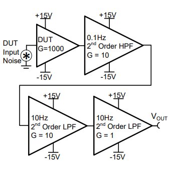

# src-ds1000z-noise-meas

Utility to measure and characterize 0.1 to 10Hz noise with a Rigol DS1000Z series scope.
Note that the DS1000Z on its own cannot measure lower than 1mV levels so a test circuit 
is needed to provide extra gain and filtering (se examples below). 

## Test circuit in TI SLAU522 design
  
Source: [https://www.ti.com/lit/ug/slau522/slau522.pdf](https://www.ti.com/lit/ug/slau522/slau522.pdf)

## Test circuit from LT1028 datasheet
  
Source: [https://www.analog.com/media/en/technical-documentation/data-sheets/1028fd.pdf](https://www.analog.com/media/en/technical-documentation/data-sheets/1028fd.pdf)

# Setup
To install required dependencies using pip:

`pip3 install -r requirements.txt`

# Usage
Execute the main.py file with python3 and appropriate parameters (below), for example: `python3 main.py 192.168.100.64 --scale 1e-3 --gain 1e6`.
```
usage: main.py [-h] [-c CH] [-s SCALE] [-C {DC,AC}] [-g GAIN] IP|VISA

Noise measurement utility

positional arguments:
  IP|VISA               IP or VISA resource string to instrument

optional arguments:
  -h, --help            show this help message and exit
  -c CH, --channel CH   Oscilloscope channel to measure on
  -s SCALE, --scale SCALE
                        Oscilloscope vertical scale
  -C {DC,AC}, --coupling {DC,AC}
                        DC or AC coupling
  -g GAIN, --gain GAIN  Pre-amplifier/setup gain
```

# Screenshots
Measured using a SLAU522 test circuit.

## LT1028


## A potato
